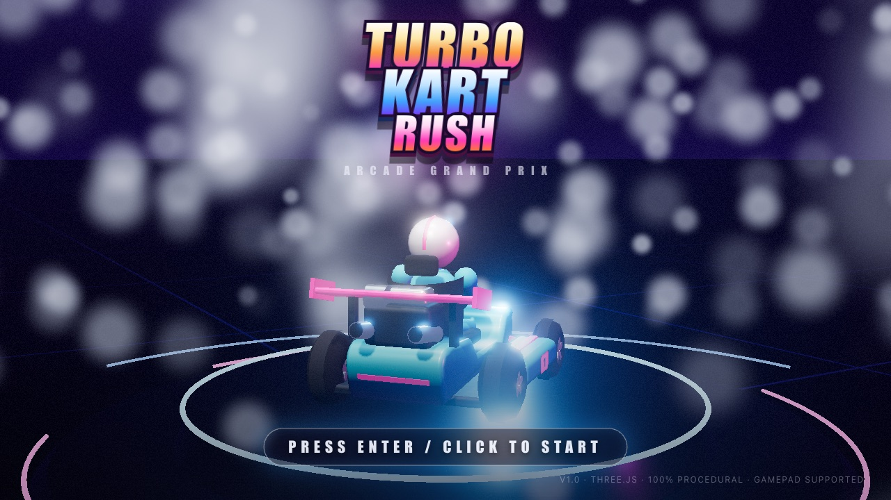
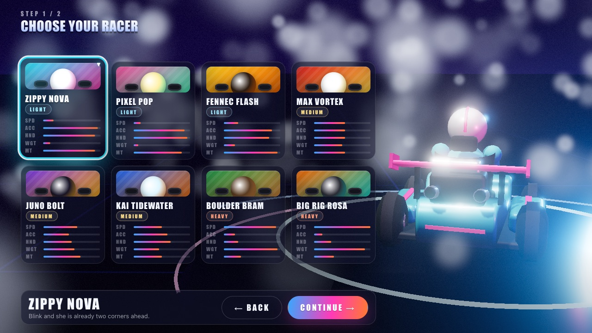
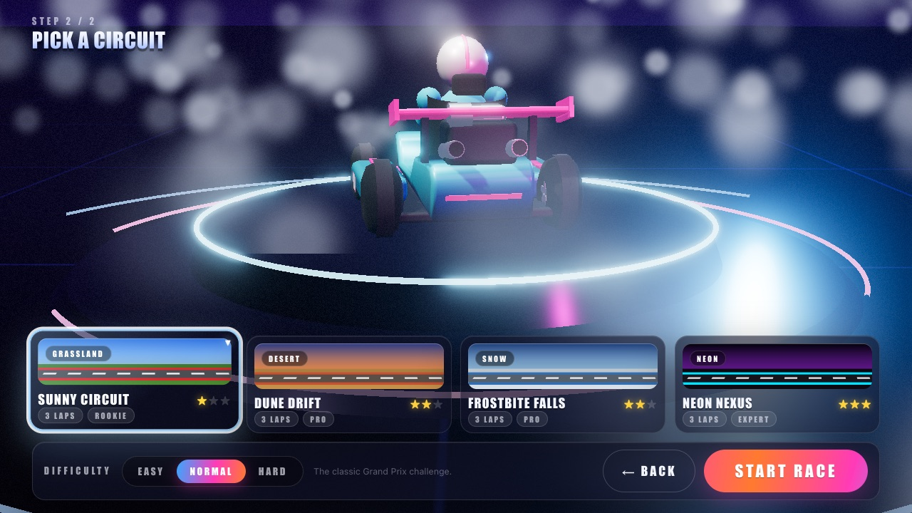

# Turbo Kart Rush

**An arcade kart racer in the spirit of Mario Kart, built entirely with Three.js. Every mesh, texture, sound effect and music track is generated in code at load time. There are no asset files in this repository.**

The whole game was produced by five Claude Fable 5.1 sub-agents working in parallel from a single prompt, without a single follow-up question. The prompt is reproduced below.

<p align="center">
  <a href="https://bridge-mind.github.io/turbo-kart-rush/"></a>
</p>

<p align="center">
  <a href="https://bridge-mind.github.io/turbo-kart-rush/"><strong>▶ Play it in your browser</strong></a>
</p>

## Play

Open **https://bridge-mind.github.io/turbo-kart-rush/** in a desktop browser with WebGL2 (Chrome, Edge, Firefox or Safari). Click or press Enter on the title screen, choose one of eight racers, pick a circuit and difficulty, then Start Race. A keyboard or a gamepad works.

Three laps against seven AI drivers. Drift through corners and release for a mini-turbo. Grab item boxes and fire shells, drop bananas, pop mushrooms, or call down lightning on the field.

## The prompt that built this

This is the complete, verbatim prompt given to Claude Code. Nothing else was specified.

> I need you to launch five Fable 5.1 sub-agents and help me build a triple A quality game that is a clone of Mario Kart. What I want you to do is I want you to launch these sub-agents, build the game without asking me any questions at all, and use 3JS to build the game. And once you're done, report back to me.

## How it was built

The orchestrating agent wrote an architecture contract first, then launched five sub-agents that each owned one slice of the codebase and built against shared TypeScript interfaces and a typed event bus. No sub-agent edited another's files.

| Workstream | Owns | Delivers |
| --- | --- | --- |
| A | `src/game`, `src/ui`, `src/main.ts` | Game loop, renderer, race manager, chase camera, HUD, menus, results |
| B | `src/kart` | Arcade kart physics, drift and mini-turbo, kart model, input, roster |
| C | `src/track` | Procedural track builder, four circuits, terrain, sky, decorations, grandstands |
| D | `src/items`, `src/ai` | Item boxes and ten items, AI drivers with personalities and rubber-banding |
| E | `src/audio`, `src/fx` | Web Audio engine and music sequencer, particle system, post-processing |

The contract every agent built against is in [CONTRACT.md](CONTRACT.md). It fixes the world conventions, the public API of each module, the game flow and the quality bar. `src/core` holds the shared types, constants, math helpers and event bus, and was frozen before the sub-agents started.

## Features

- **Eight racers** in three weight classes, each with their own kart, colours and handling: Zippy Nova, Pixel Pop, Fennec Flash, Max Vortex, Juno Bolt, Kai Tidewater, Boulder Bram and Big Rig Rosa.
- **Four circuits**, each 900 to 1400 metres with hills, a jump crest, hairpins, S-bends and a long straight: Sunny Circuit (grassland), Dune Drift (desert), Frostbite Falls (snow, with a void section over ice) and Neon Nexus (night city).
- **Arcade handling** with hop, drift, three-stage mini-turbo, boost pads, off-road slowdown, wall bumps and kart-to-kart collisions resolved by weight.
- **Ten items**: banana, green shell, red shell, blue shell, mushroom, triple mushroom, golden mushroom, star, lightning and bob-omb. Item odds are weighted by race position.
- **AI drivers** that follow a racing line, drift on corners, dodge hazards, hunt item boxes, use items sensibly and rubber-band toward the player.
- **Fully synthesised audio**: per-kart engine synthesis with positional panning, dozens of sound effects, and a procedural chiptune sequencer with separate menu, race, final-lap and results music.
- **Effects**: a 6000-particle GPU pool for drift sparks, boost flames, tyre smoke, dust and speed streaks, plus bloom, speed lines, radial blur, chromatic aberration and vignette in a post-processing stack.
- **Broadcast-style presentation**: 3-2-1-GO countdown, position and lap HUD, item roulette, minimap, final-lap and wrong-way banners, results screen with confetti.
- **Gamepad support** alongside the keyboard.

## Controls

| Action | Keyboard | Gamepad |
| --- | --- | --- |
| Throttle | W or Up | Right trigger |
| Brake / reverse | S or Down | Left trigger |
| Steer | A and D, or Left and Right | Left stick |
| Hop / drift | Space or Shift | A or RB |
| Use item | E, Ctrl or Enter | X or LB |
| Look back | Q | |
| Pause | Esc or P | Start |
| Menu confirm / back | Enter or Space / Esc | A / B |

Hold drift through a corner. Sparks turn blue, then orange, then purple. Release for a bigger boost the longer you held it.

## Run it locally

```bash
git clone https://github.com/bridge-mind/turbo-kart-rush.git
cd turbo-kart-rush
npm install
npm run dev
```

Open the URL Vite prints, which is http://localhost:5178/ by default.

| Script | What it does |
| --- | --- |
| `npm run dev` | Dev server with hot reload. Starts the multiplayer server too, so online play works out of the box |
| `npm run build` | Production build into `dist/` |
| `npm run serve` | Build, then serve the game and the multiplayer sockets from one process on `:3000` |
| `npm start` | Runs the server against the committed build - what a host that auto-runs a `start` script (Bonto, Glitch-style PaaS) executes |
| `npm run server` | Multiplayer server only, against whatever is already in `dist/` |
| `npm run preview` | Serve the production build (static only - no multiplayer) |
| `npm run typecheck` | TypeScript check with no emit |
| `npm run check:browser` | Puppeteer pass over the built game: every circuit, a full race, a two-player online race |
| `npm run check:mobile` | Same, on an emulated phone in portrait and landscape |

Online play needs the multiplayer server (`server/index.js`). `npm run dev` and
`npm run serve` both start it; `npm run preview` does not.

## Project layout

```
turbo-kart-rush/
├── index.html                 entry page, a single #app div and the module script
├── CONTRACT.md                architecture contract the five sub-agents built against
├── src/
│   ├── main.ts                boots the Game
│   ├── style.css              menus, HUD and results styling
│   ├── core/                  frozen shared layer: types, constants, math, event bus
│   ├── game/                  Game loop, RaceManager, FollowCamera, menu backdrop
│   ├── ui/                    MainMenu, HUD, Minimap, PauseMenu, ResultsScreen, LoadingScreen
│   ├── kart/                  Kart physics, KartModel, InputManager, roster
│   ├── track/                 Track, Centerline, TerrainField, textures, builders/, tracks/
│   ├── items/                 ItemManager and item visuals
│   ├── ai/                    AIDriver
│   ├── audio/                 AudioEngine, engine synthesis, sfx, music sequencer
│   └── fx/                    ParticleSystem, PostFX, shaders
├── docs/screenshots/          images used in this README
└── .github/workflows/         builds and deploys to GitHub Pages on every push to main
```

## Technical notes

- **Stack**: Three.js 0.185, TypeScript, Vite 8. WebGL2 with `ACESFilmicToneMapping` and shadow maps.
- **Simulation**: a fixed-step accumulator drives kart physics, items, AI and race logic; rendering, camera, particles, audio and HUD run at display rate.
- **Procedural everything**: textures are drawn onto canvases at load, geometry is built from primitives and merged or instanced, audio is synthesised with the Web Audio API. The production bundle is a single JavaScript file and a stylesheet.
- **Performance targets** from the contract: 60 fps at 1080p on a 2020 laptop, under about 400 draw calls, one shadow-casting light, instanced decorations, and everything disposable so returning to the menu doesn't leak.

## Deploying

The game is two pieces: a static client (`dist/`) and the multiplayer server
(`server/index.js`), which keeps a Socket.IO WebSocket open per player.

**A static host cannot run the server.** Vercel, Netlify and GitHub Pages serve
files. Nothing on those origins answers `wss://<your-site>/socket.io`, so single
player works and PLAY ONLINE fails with a refused WebSocket. Two ways round it:

### One host for everything (simplest, and free)

Deploy the repo somewhere that runs a Node process and holds WebSockets open.
Every option below serves `dist/` and the sockets from the same origin, so
there is nothing to configure - no environment variables, no second
deployment - and the deployed URL is the one to share with the people you
want to race.

**No credit card at all:** [Bonto](https://bonto.dev) hosts a full Node.js
server (not a serverless function) with WebSocket support, free, without asking
for payment details.

Bonto has no separate build-command field - Glitch-style, it runs `npm install`
then whatever your `start` script says. It also installs production
dependencies only, so `vite` is not there to build with, and a 512MB container
has no business running rollup on every wake in any case. So the build does not
happen on the host at all:

- `dist/index.html` and the hashed bundle are **committed** to this repo.
- `public/` is served straight from the repo by `server/index.js`, so the 25MB
  of karts, audio and fonts are not duplicated into `dist/` in git.
- `npm start` is therefore just `node server/index.js`, and a wake from sleep
  is instant.

1. Sign up at bonto.dev, create a Node.js app, and connect this GitHub repo
   (or use Bonto's git push-to-deploy if you'd rather push directly).
2. Deploy. Bonto runs `npm install && npm start` and gives the app a
   `.bonto.run` URL.

**When you change client code, run `npm run build` and commit the changed
`dist/` files** - otherwise the deployed game stays on the previous bundle.
Vercel and GitHub Pages are unaffected by this: they run their own build.

If the page you get back is the raw source instead of the game - a blank page,
or the browser console mentioning `/src/main.ts` - the project was created as a
**static site** rather than a **Node.js app**; recreate it as the latter so
`npm start` actually runs.

A free app sleeps after 30 minutes idle and wakes on the next request, same
as the option below - the lobby's "waking the game server" message and the
client's patient retry cover this either way.

**If you don't mind a card on file:** Render's free web-service tier is $0
unless you exceed the free limits or upgrade, and `render.yaml` in this repo
is a ready-made blueprint for it:

[](https://render.com/deploy?repo=https://github.com/DiaeEddineJamal/Racing-Game-)

Railway and Fly.io work the same way (`npm ci && npm run build` to build,
`node server/index.js` to start) but both ask for a card too. A VPS you
already pay for sidesteps the question entirely.

### Client on Vercel, server elsewhere

This is the shape to use if you already have the game live on Vercel (or want
Vercel specifically for the client) and just want online play to work too -
Vercel keeps serving the client exactly as it does now; only the socket
connection is redirected to a server running somewhere that can hold a
WebSocket open.

1. Deploy `server/index.js` to a host that supports WebSockets - **Bonto**
   needs no card, per the section above (create it as a Node.js app, connect
   the repo, `npm start` does the rest); Render/Railway/Fly.io work too if a
   card is fine. Note the URL it gives you, e.g.
   `https://lmongolyan-kart.bonto.run`.
2. In the Vercel dashboard: **Project → Settings → Environment Variables** →
   add `VITE_GAME_SERVER` = that URL (Production, and Preview if you want
   preview deploys to connect too).
3. **Redeploy** - Deployments tab → the three-dot menu on the latest one →
   Redeploy. The value is baked into the JS bundle at build time, so an
   existing deployment will not pick it up without this step.
4. Nothing to change on the server itself: it already reflects whatever
   origin makes the request in its CORS headers, so your `*.vercel.app` domain
   is accepted automatically.

A free server sleeps when idle, so the first connection after a quiet spell
takes a few seconds to a minute while it wakes - the lobby says so instead of
looking stuck, and the client keeps retrying rather than giving up early.

### GitHub Pages

Every push to `main` runs `.github/workflows/deploy.yml`, which type-checks,
builds and publishes `dist/` to GitHub Pages. Vite is configured with a relative
`base`, so the build works from any sub-path. For online play there, set a
repository variable named `VITE_GAME_SERVER`; the workflow passes it to the
build.

## Screenshots

| | |
| --- | --- |
|  |  |
|  |  |

## Disclaimer

Turbo Kart Rush is an original, fan-made homage to the kart-racing genre. It is not affiliated with, endorsed by, or associated with Nintendo. All characters, circuits, names, art, music and code in this repository are original.

## License

[MIT](LICENSE) © 2026 BridgeMind
